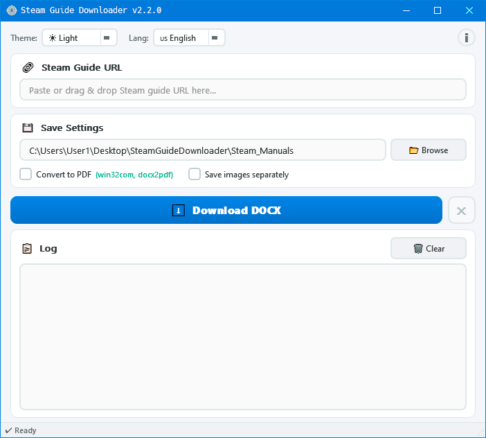
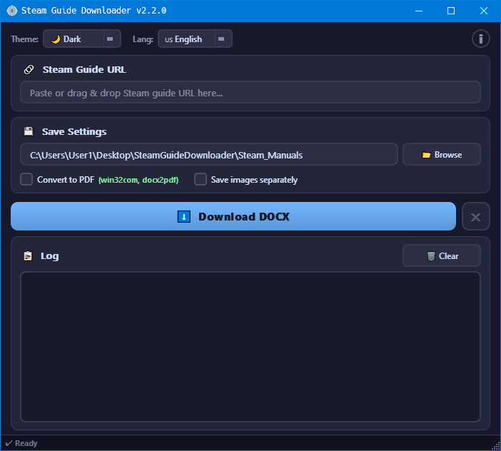

<div align="center">


# Steam Guide Downloader

> Download Steam Community guides as DOCX & PDF

[](https://www.python.org/downloads/)
[](https://pypi.org/project/PyQt6/)
[](LICENSE)
[](https://github.com/AlexAgents/steam-guide-downloader)
[](https://github.com/AlexAgents/steam-guide-downloader/releases/latest)

[](README.ru.md)

</div>

---

## 📋 Table of Contents

- [About](#-about)
- [Features](#-features)
- [Screenshots](#-screenshots)
- [Requirements](#-requirements)
- [Installation](#-installation)
- [Quick Start](#-quick-start)
- [Supported URLs](#-supported-urls)
- [PDF Conversion](#-pdf-conversion)
- [Project Structure](#-project-structure)
- [Testing](#-testing)
- [Build EXE](#-build-exe)
- [Cleaning Scripts](#-cleaning-scripts)
- [Steam Guides](#-steam-guides)
- [License](#-license)
- [Author](#-author)

## 📖 About

**Steam Guide Downloader** is a desktop application for downloading **Steam Community guides** and saving them as **DOCX**, with optional **PDF conversion** and **separate image export**.

## ✨ Features

- Download Steam guides to DOCX
- Optional PDF conversion
- Save images separately
- Light and Dark themes
- English and Russian interface
- Session logs
- Path validation
- Large page warning
- Interactive EXE builder

## 📸 Screenshots

<details>
<summary><b>Click to expand gallery</b></summary>

<br>

<div align="center">

| Light Theme | Dark Theme |
|:---:|:---:|
|  |  |

</div>

</details>

## 📋 Requirements

| Component | Version | Purpose |
|:---|:---|:---|
| Python | 3.10+ | Runtime environment |
| PyQt6 | 6.5+ | Desktop GUI |
| requests | 2.28+ | HTTP requests |
| beautifulsoup4 | 4.12+ | HTML parsing |
| python-docx | 0.8.11+ | DOCX generation |
| Pillow | 9.0+ | Optional image processing |

## 🚀 Installation

### Ready-made EXE (Windows)

Download the latest release from [Releases](https://github.com/AlexAgents/steam-guide-downloader/releases) — no Python required.

### From source

```bash
git clone https://github.com/AlexAgents/steam-guide-downloader.git
cd steam-guide-downloader
pip install -r requirements.txt
python __main__.py
```

## ⚡ Quick Start

1. Launch the application
2. Paste a valid Steam guide URL
3. Choose a save folder
4. Click **Download DOCX**
5. Optionally enable PDF conversion and separate image saving

## 🔗 Supported URLs

```text
https://steamcommunity.com/sharedfiles/filedetails/?id=XXXXXXXXX
```

## 📄 PDF Conversion

| Method | Install | Platform |
|:---|:---|:---|
| MS Word (pywin32) | `pip install pywin32` | Windows |
| MS Word (comtypes) | `pip install comtypes` | Windows |
| docx2pdf | `pip install docx2pdf` | Windows / macOS |
| LibreOffice | Install manually | Windows / Linux / macOS |

## 📂 Project Structure

<details>
<summary>📂 <b>Expand file tree</b></summary>

```text
steam-guide-downloader/
├── 🚀 __main__.py
├── 📁 app/
│   ├── 🐍 __init__.py
│   ├── 🐍 about.py
│   ├── ⚙️ config.py
│   ├── 🛠️ paths.py
│   ├── 🐍 translations.py
│   ├── 🛠️ utils.py
│   ├── 📁 core/
│   │   ├── 🐍 __init__.py
│   │   ├── 🔧 network.py
│   │   ├── 📊 parser.py
│   │   ├── 📊 docx_builder.py
│   │   ├── 📊 image_saver.py
│   │   └── 🔧 pdf_converter.py
│   └── 📁 gui/
│       ├── 🐍 __init__.py
│       ├── 🐍 main_window.py
│       └── 🐍 icon_provider.py
├── 📁 themes/
│   ├── ☀️ light.qss
│   └── 🌙 dark.qss
├── 📁 assets/
│   └── 🎨 icon.ico
├── 📁 scripts/
│   ├── 🔨 builder.py
│   ├── 🔨 clean.bat
│   ├── 🔨 clean.ps1
│   └── 🔨 clean.sh
├── 📁 tests/
│   ├── 🐍 __init__.py
│   ├── 🧪 run_tests.py
│   ├── 🧪 test_config.py
│   ├── 🧪 test_docx_builder.py
│   ├── 🧪 test_network.py
│   ├── 🧪 test_paths.py
│   ├── 🧪 test_translations.py
│   ├── 🧪 test_utils.py
│   └── 🧪 test_validator.py
├── 📜 LICENSE
├── 🙈 .gitignore
├── 📖 README.md
├── 📖 README.ru.md
├── 📖 Release_notes.md
└── 📋 requirements.txt
```

</details>

## 🧪 Testing

```bash
pytest tests/ -v
python tests/run_tests.py
```

## 📦 Build EXE

```bash
python scripts/builder.py
python scripts/builder.py --build
```

## 🧹 Cleaning Scripts

```bash
chmod +x scripts/clean.sh && ./scripts/clean.sh
scripts\clean.bat
powershell -ExecutionPolicy Bypass -File scripts\clean.ps1
```

## 📖 Steam Guides

- 🇬🇧 [Steam Guide (English)](https://steamcommunity.com/sharedfiles/filedetails/?id=3668298513)

## 📝 License

This project is licensed under the **MIT License** — see [LICENSE](LICENSE).

## 👤 Author

**AlexAgents** — [GitHub](https://github.com/AlexAgents/steam-guide-downloader)

---

<div align="center">

*Licensed under [MIT](LICENSE) • © 2025-2026 AlexAgents*

</div>
