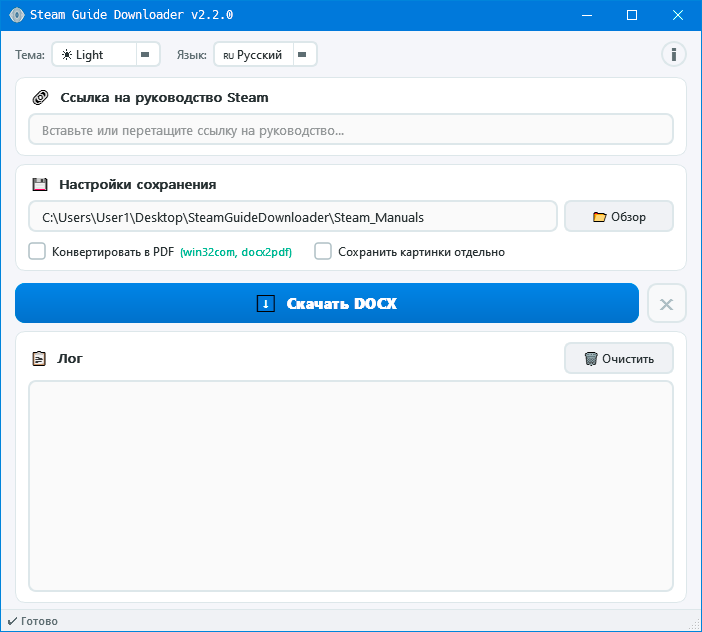
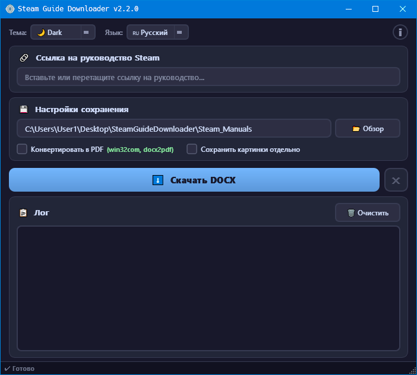

<div align="center">


# Steam Guide Downloader

> Скачивание руководств Steam в DOCX и PDF

[](https://www.python.org/downloads/)
[](https://pypi.org/project/PyQt6/)
[](LICENSE)
[](https://github.com/AlexAgents/steam-guide-downloader)
[](https://github.com/AlexAgents/steam-guide-downloader/releases/latest)

[](README.md)

</div>

---

## 📋 Содержание

- [О проекте](#-о-проекте)
- [Возможности](#-возможности)
- [Скриншоты](#-скриншоты)
- [Требования](#-требования)
- [Установка](#-установка)
- [Быстрый старт](#-быстрый-старт)
- [Поддерживаемые ссылки](#-поддерживаемые-ссылки)
- [Конвертация в PDF](#-конвертация-в-pdf)
- [Структура проекта](#-структура-проекта)
- [Тесты](#-тесты)
- [Сборка EXE](#-сборка-exe)
- [Скрипты очистки](#-скрипты-очистки)
- [Steam Guides](#-steam-guides)
- [Лицензия](#-лицензия)
- [Автор](#-автор)

## 📖 О проекте

**Steam Guide Downloader** — настольное приложение для скачивания **руководств Steam Community** и сохранения их в **DOCX**, с опциональной **конвертацией в PDF** и **отдельным сохранением изображений**.

## ✨ Возможности

- Скачивание руководств Steam в DOCX
- Опциональная конвертация в PDF
- Отдельное сохранение изображений
- Светлая и тёмная тема
- Русский и английский интерфейс
- Логи сессий
- Проверка путей
- Предупреждение для больших страниц
- Интерактивный сборщик EXE

## 📸 Скриншоты

<details>
<summary><b>Нажмите, чтобы раскрыть галерею</b></summary>

<br>

<div align="center">

| Светлая тема | Тёмная тема |
|:---:|:---:|
|  |  |

</div>

</details>

## 📋 Требования

| Компонент | Версия | Назначение |
|:---|:---|:---|
| Python | 3.10+ | Среда выполнения |
| PyQt6 | 6.5+ | GUI |
| requests | 2.28+ | HTTP-запросы |
| beautifulsoup4 | 4.12+ | Парсинг HTML |
| python-docx | 0.8.11+ | Генерация DOCX |
| Pillow | 9.0+ | Опциональная обработка изображений |

## 🚀 Установка

### Готовый EXE (Windows)

Скачайте последнюю версию из раздела [Releases](https://github.com/AlexAgents/steam-guide-downloader/releases) — Python не нужен.

### Из исходников

```bash
git clone https://github.com/AlexAgents/steam-guide-downloader.git
cd steam-guide-downloader
pip install -r requirements.txt
python __main__.py
```

## ⚡ Быстрый старт

1. Запустите приложение
2. Вставьте корректную ссылку на руководство Steam
3. Выберите папку сохранения
4. Нажмите **Скачать DOCX**
5. При необходимости включите PDF и отдельное сохранение изображений

## 🔗 Поддерживаемые ссылки

```text
https://steamcommunity.com/sharedfiles/filedetails/?id=XXXXXXXXX
```

## 📄 Конвертация в PDF

| Способ | Установка | Платформа |
|:---|:---|:---|
| MS Word (pywin32) | `pip install pywin32` | Windows |
| MS Word (comtypes) | `pip install comtypes` | Windows |
| docx2pdf | `pip install docx2pdf` | Windows / macOS |
| LibreOffice | Установить вручную | Windows / Linux / macOS |

## 📂 Структура проекта

<details>
<summary>📂 <b>Показать дерево файлов</b></summary>

```text
steam-guide-downloader/
├── 🚀 __main__.py
├── 📁 app/
│   ├── 🐍 __init__.py
│   ├── 🐍 about.py
│   ├── ⚙️ config.py
│   ├── 🛠️ paths.py
│   ├── 🐍 translations.py
│   ├── 🛠️ utils.py
│   ├── 📁 core/
│   │   ├── 🐍 __init__.py
│   │   ├── 🔧 network.py
│   │   ├── 📊 parser.py
│   │   ├── 📊 docx_builder.py
│   │   ├── 📊 image_saver.py
│   │   └── 🔧 pdf_converter.py
│   └── 📁 gui/
│       ├── 🐍 __init__.py
│       ├── 🐍 main_window.py
│       └── 🐍 icon_provider.py
├── 📁 themes/
│   ├── ☀️ light.qss
│   └── 🌙 dark.qss
├── 📁 assets/
│   └── 🎨 icon.ico
├── 📁 scripts/
│   ├── 🔨 builder.py
│   ├── 🔨 clean.bat
│   ├── 🔨 clean.ps1
│   └── 🔨 clean.sh
├── 📁 tests/
│   ├── 🐍 __init__.py
│   ├── 🧪 run_tests.py
│   ├── 🧪 test_config.py
│   ├── 🧪 test_docx_builder.py
│   ├── 🧪 test_network.py
│   ├── 🧪 test_paths.py
│   ├── 🧪 test_translations.py
│   ├── 🧪 test_utils.py
│   └── 🧪 test_validator.py
├── 📜 LICENSE
├── 🙈 .gitignore
├── 📖 README.md
├── 📖 README.ru.md
├── 📖 Release_notes.md
└── 📋 requirements.txt
```

</details>

## 🧪 Тесты

```bash
pytest tests/ -v
python tests/run_tests.py
```

## 📦 Сборка EXE

```bash
python scripts/builder.py
python scripts/builder.py --build
```

## 🧹 Скрипты очистки

```bash
chmod +x scripts/clean.sh && ./scripts/clean.sh
scripts\clean.bat
powershell -ExecutionPolicy Bypass -File scripts\clean.ps1
```

## 📖 Steam Guides

- 🇷🇺 [Руководство в Steam (Русский)](https://steamcommunity.com/sharedfiles/filedetails/?id=3668303547)

## 📝 Лицензия

Проект распространяется по лицензии **MIT** — см. [LICENSE](LICENSE).

## 👤 Автор

**AlexAgents** — [GitHub](https://github.com/AlexAgents/steam-guide-downloader)

---

<div align="center">

*Licensed under [MIT](LICENSE) • © 2025-2026 AlexAgents*

</div>
